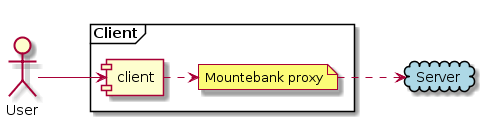

# Demo3: Mountebank

Start up the containers in `demo3-mountebank` by using command `docker-compose up`.

This will start a server and a client container. 

### The server

* Mountebank runs on port 9525
* Server mock runs on port 9000
* GET /random-book will return responses in the following order:
  * 4 book data
  * 1 book data with 3 seconds of delay
  * 2 response with status 500
* A hidden book is revealed when the following request is sent:  
`curl -X POST http://localhost:9000/hidden-book -d "{\"token\":123}"`
> The token can be anything except 666

Documentation and imposters can be viewed on `http://localhost:9525` (requests are also visible).

> Books data is from the [35 Funniest Book Titles And Covers](https://digitalsynopsis.com/buzz/worst-funniest-book-titles-covers/) 
blog post

### The client

* Mountebank runs on port 8525
* Client mock runs on port 8000
* GET /random-book will fetch responses from the server endpoint in record proxy mode
* The client has a decorator what:
  * removes the link from the source response
  * replaces some unwanted words
  * logs requests with original responses to file `demo3-mountebank\client\response.log`

Now you can kill the server and set the client into replay mode to see that the client can replay requests:  
`docker stop server`  
`docker exec -it client sh`  
`# mb replay`

This is an architectural diagram how the client calls the server:

