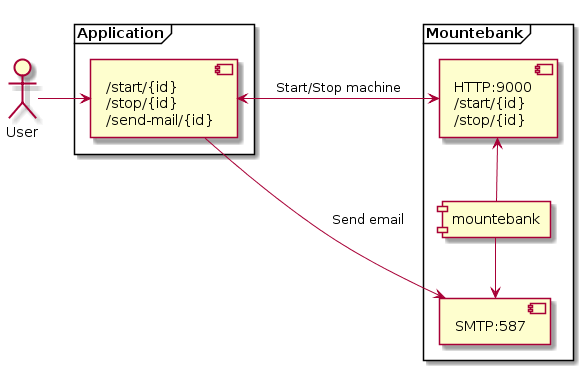
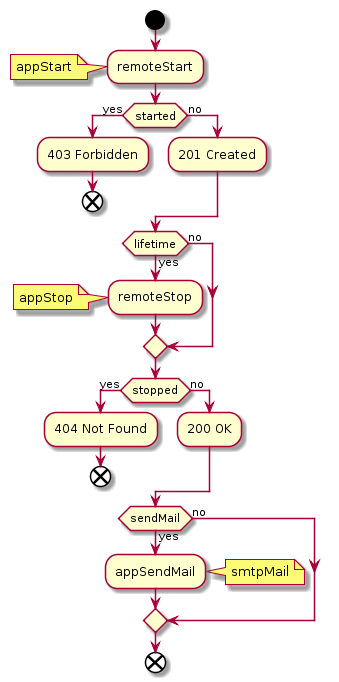

# Demo4: State machine

In this demo we are going to build a state machine.
We have a REST API (application) which has the following endpoints:

* POST /start/{id}
* POST /stop/{id}
* POST /send-mail/{id}

We have an imposter to simulate the state machine, which also has a REST interface:

* POST /start/{id}
* POST /stop/{id}

We have a separate imposter to simulate mail server.



This is an activity diagram which helps you understand the state machine transitions. 
The yellow notes are the interaction points with other services.



Regarding to the diagram we can see:
* an already running machine can't be started
* a machine is considered not found when it stops, so it can't be stopped more than once
* a machine can be started with a lifetime, which will trigger automatic stop when it exceeds
* a machine could be stopped anytime before the end of it's lifetime
* a machine could be configured to send an email when it stops, even if it stopped manually or due to end of lifetime
 

### Commands to play with the state machine

* Start the imposters by running `docker-compose up` in the folder `demo4-statemachine\mountebank`
* Start the Java application from your IDE by running the `com.example.statemachine.Application` class or by using `./gradlew bootrun`
* Post Start/Stop operations to the application to start or stop a machine:
  * Start with a lifetime and send email when it stops: 
  ```
  curl -v -X POST http://localhost:8080/start/111 \
  -H "Content-Type: application/json" \
  -d "{\"lifetime\":3, \"sendMail\":true}"
  ```
  You will see the following logs in the statemachine container logs:
  ```
  statemachine    | Started 111
  statemachine    | Sending mail to 111 ...
  statemachine    | Stopped 111 (end of lifetime)
  ```
  
  * Check the email imposter requests to see if the email mock server was called. You should see something similar:
  ```
    $ curl http://localhost:2525/imposters/587
    {
      "protocol": "smtp",
      "port": 587,
      "numberOfRequests": 1,
      "requests": [
        {
          "requestFrom": "127.0.0.1",
          "envelopeFrom": "machine@mail.com",
          "envelopeTo": [
            "111@mail.com"
          ],
          "from": {
            "address": "machine@mail.com",
            "name": ""
          },
          "to": [
            {
              "address": "111@mail.com",
              "name": ""
            }
          ],
          "cc": [],
          "bcc": [],
          "priority": "normal",
          "references": [],
          "inReplyTo": [],
          "text": "111 stopped at 2019-01-17T17:21:05.341581Z",
          "html": "",
          "attachments": [],
          "timestamp": "2019-01-17T17:21:05.654Z"
        }
      ],
      "stubs": [],
      "_links": {
        "self": {
          "href": "http://localhost:2525/imposters/587"
        }
      }
    }%                                                                             
    ```
  
  * Start without lifetime and don't send email:
  ```
  curl -v -X POST http://localhost:8080/start/111 \
  -H "Content-Type: application/json" \
  -d "{}"
  ```
  
  * Now try to start it again by repeating the command, and you will see the following response:
  ```
  $ curl -v -X POST http://localhost:8080/start/111 \
    -H "Content-Type: application/json" -d "{}"
  Note: Unnecessary use of -X or --request, POST is already inferred.
  *   Trying ::1...
  * Connected to localhost (::1) port 8080 (#0)
  > POST /start/111 HTTP/1.1
  > Host: localhost:8080
  > User-Agent: curl/7.47.0
  > Accept: */*
  > Content-Type: application/json
  > Content-Length: 2
  > 
  * upload completely sent off: 2 out of 2 bytes
  < HTTP/1.1 403 
  < Content-Type: text/plain;charset=UTF-8
  < Content-Length: 25
  < Date: Thu, 17 Jan 2019 17:26:37 GMT
  < 
  * Connection #0 to host localhost left intact
  Id 111 is already started%
  ```
  
  * Stop the machine:
  ```
  curl -v -X POST http://localhost:8080/stop/111
  ```
  In the container logs you will see this (without *end of lifetime*):
  ```
  statemachine    | Stopped 111
  ```
  
  * Now try to stop it again by repeating the command, and you will see the following response:
  ```
  $ curl -v -X POST http://localhost:8080/stop/111
  *   Trying ::1...
  * Connected to localhost (::1) port 8080 (#0)
  > POST /stop/111 HTTP/1.1
  > Host: localhost:8080
  > User-Agent: curl/7.47.0
  > Accept: */*
  > 
  < HTTP/1.1 404 
  < Content-Type: text/plain;charset=UTF-8
  < Content-Length: 16
  < Date: Thu, 17 Jan 2019 17:31:59 GMT
  < 
  * Connection #0 to host localhost left intact
  Id 111 not found%      
  ```
  